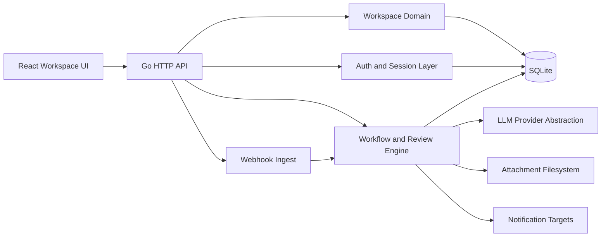
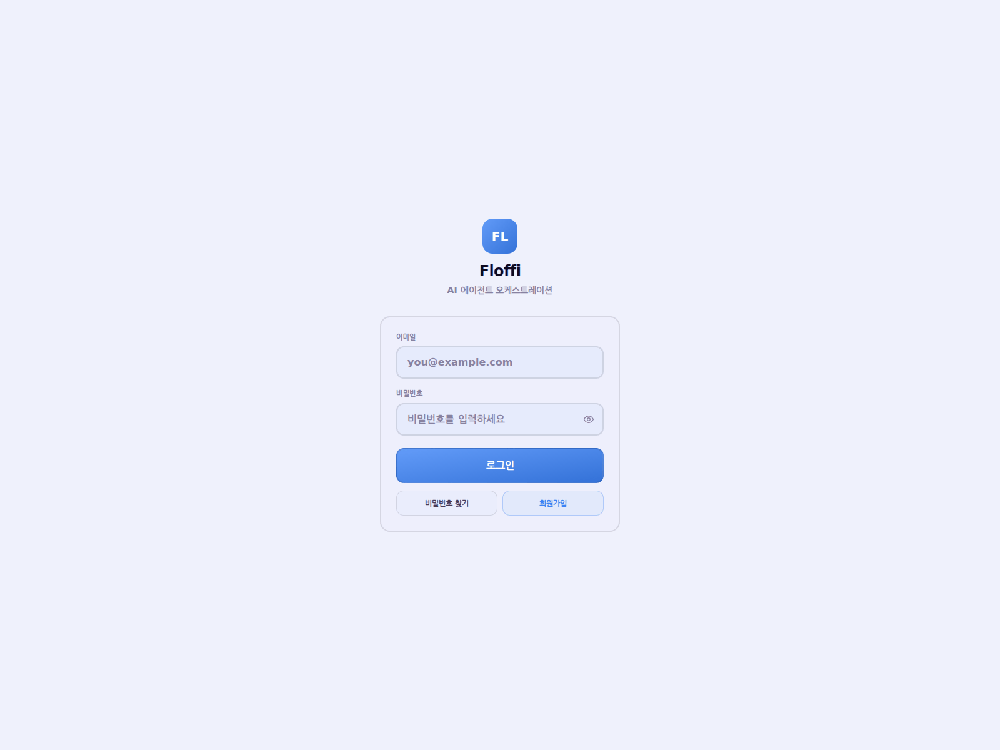
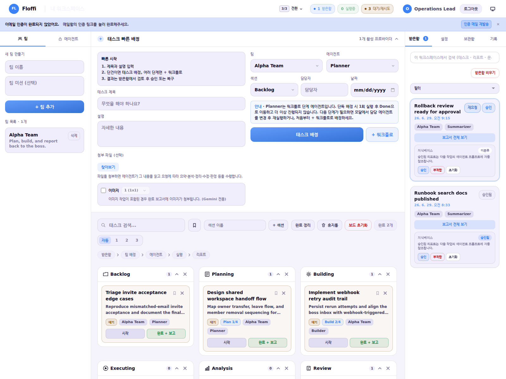
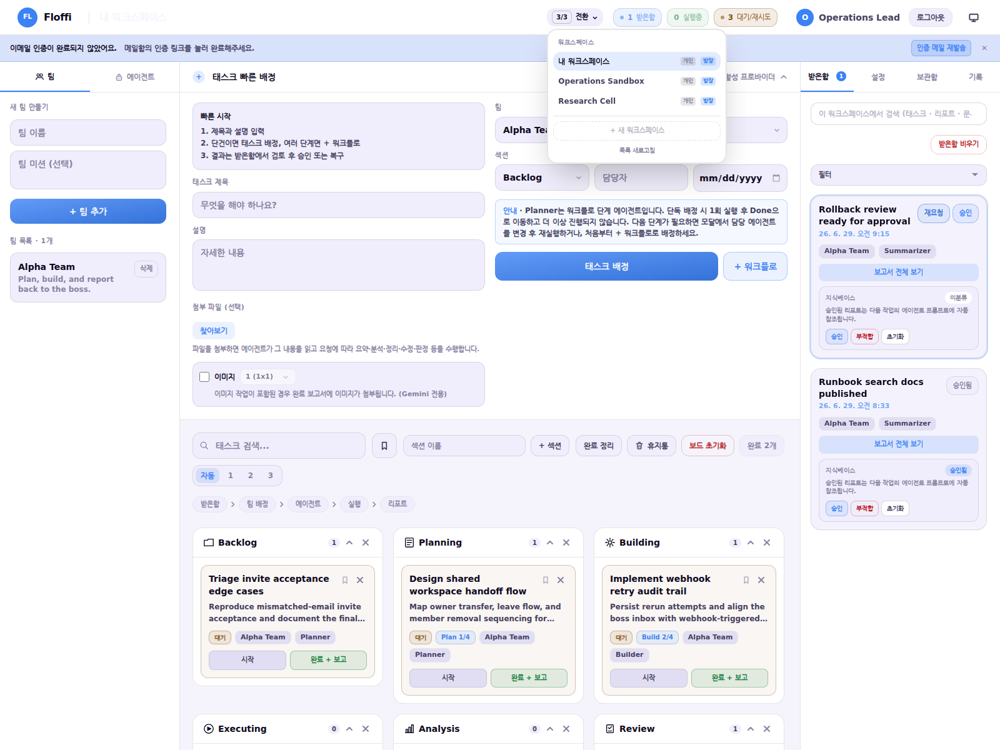
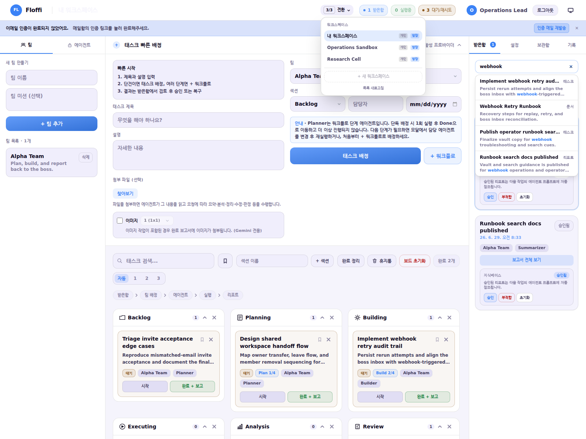
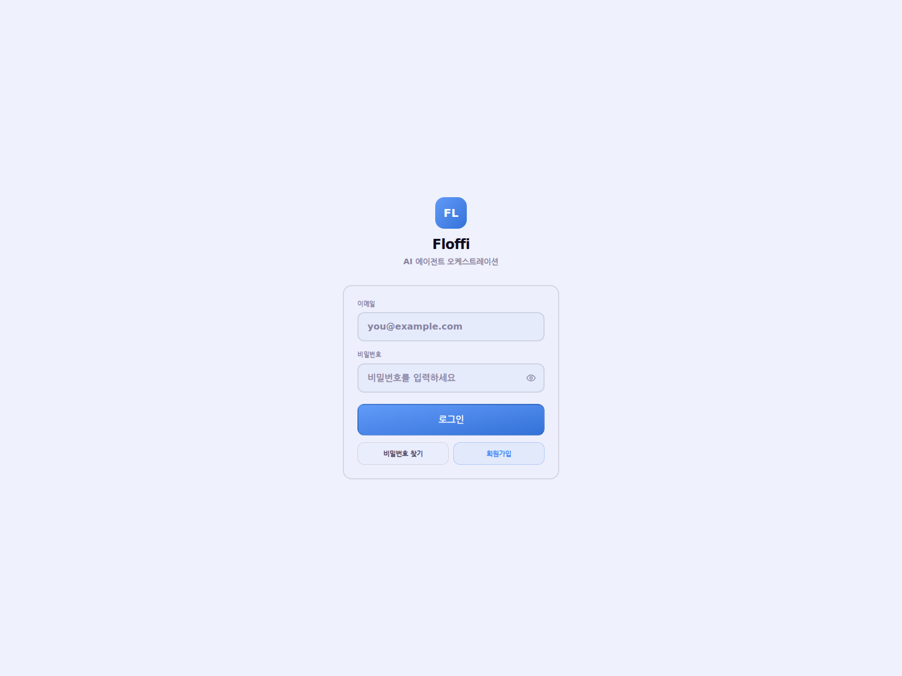

# floffi

`floffi` is an **AI agent orchestration workspace** for creating, executing, reviewing, and operating multi-step agent work.

It is built to show how AI work can remain **reviewable, recoverable, and operable** inside a real product, with explicit review loops, recoverable workflow state, workspace isolation, webhook-driven task intake, and long-lived persistence.

- Repository: `https://github.com/yeonjoosong/floffi-public`
- Live Preview: `https://yeonjoosong.github.io/floffi-public/`

## Why This Project Exists

Most AI applications solve a single request. `floffi` explores a harder problem: **how to keep AI work operable inside a real product**.

The goal of this project is to make AI agent work manageable inside a real application environment:

- A user creates or receives work inside a workspace
- Agents execute multi-step workflows and hand tasks across stages
- Results are reviewed through a boss inbox instead of being blindly accepted
- Failed or rejected work can be rerun, rolled back, or restored without drifting from persisted state
- The system stays usable under product constraints such as auth, sessions, MFA, multi-workspace collaboration, webhooks, notifications, persistence, and search

This is the portfolio point of the repository: **not just building AI behavior, but organizing a complex orchestration product into a structure that is testable, operable, and reviewable**.

## Why This Is Hard

`floffi` combines multiple kinds of product complexity that usually live in separate projects:

- **Reviewable AI output**: LLM results are nondeterministic, so workflow output needs explicit human approval, rejection, rerun, and restore paths
- **Recoverable workflow state**: task execution, report generation, and restore behavior must survive save failures and partial workflow changes
- **Workspace isolation**: personal bootstrap, shared workspaces, invitations, membership changes, and owner transfer all need consistent tenancy boundaries
- **Operational ingestion**: webhook-triggered workflow creation and outbound notifications need stable operator-facing paths, not demo-only happy paths
- **Product-grade security**: JWT sessions, refresh flows, email verification, MFA, session revocation, and account controls must coexist with the orchestration surface

## Engineering Decisions

These are the design decisions that matter most in this repository:

- **Boss review is not just another status column**: AI output is treated as reviewable work, so approval, rejection, rerun, and restore are first-class flows instead of ad hoc status edits
- **Workspace isolation is part of the product model**: tenancy is built into auth, membership, workspace switching, and owner/admin flows rather than bolted on after the task board
- **Rollback matters as much as execution**: review actions and restore flows are designed so save failures do not silently leave UI state ahead of persisted state
- **Persistence is treated as mutable product state, not cache**: workspace data is saved with concurrency-aware behavior and recovery paths because operators expect long-lived state to remain trustworthy
- **Frontend complexity is decomposed intentionally**: orchestration behavior is split across focused hooks and panels so the UI can evolve without one top-level component becoming the entire product

## Core Product Capabilities

### 1. Agent-To-Agent Workflow Orchestration

- Create work inside a kanban-style orchestration board
- Advance tasks across explicit agent-owned workflow stages
- Keep stage progression, ownership, and task state visible to operators

### 2. Boss-Gated Report Review

- Generate reports from completed agent work
- Review output in a boss inbox before accepting it into the workspace state
- Reject, rerun, and restore work through explicit operator-facing controls

### 3. Repeatable Runbook Operations

- Turn workflow structure into repeatable operational runbooks
- Re-run flows safely instead of treating AI work as one-shot output
- Keep long-lived state trustworthy when tasks are retried or restored

### 4. Webhook And Notification Intake

- Ingest work through webhook-triggered workflow creation
- Fan notifications out to configured targets for operator awareness
- Support external-to-internal flow, not just manual board input

### 5. Workspace Context And Search

- Persist workspace state, reports, vault documents, and attachments
- Surface searchable context for follow-up operator work
- Keep orchestration state usable after the initial run is complete

## Architecture At A Glance



This is the high-level system shape behind `floffi`: a React workspace UI on top of a Go API, with auth, workspace tenancy, workflow/review logic, webhook ingestion, LLM provider abstraction, and SQLite-backed persistence tied together as one product surface.

## Workflow Overview

The highest-level product flow is:

1. A user authenticates into a personal or shared workspace
2. A task is created manually or ingested through a webhook
3. The workflow engine advances work across explicit agent-owned stages
4. A report lands in the boss inbox for approval or rejection
5. Approved, rerun, restored, and searched state is persisted back to the workspace model

## Representative Demo Visuals

The repository includes representative README visuals under `readme-preview-assets/`.
These are **actual captures from the running app** using a seeded demo workspace, so the visuals match the implemented UI and interaction model of `floffi`.

### 1. End-To-End Workflow Reel

This is the fastest way to see the product shape: authenticated entry, board-driven workflow progression, boss review, and operator context surfaces.



### 2. Agent Handoff On The Workflow Board

This is the core product surface: work moves across explicit stages, agents collaborate through the board, and operators can see workflow state instead of treating the run as a black box.



### 3. Boss-Gated Report Approval

This is the control point that matters most in the product model. AI output is not auto-accepted; reports are reviewed, approved, rejected, rerun, and restored through an explicit operator loop.



### 4. External Operations And Search Context

`floffi` is not just a manual board. Work can enter through webhook-driven flows, operators can fan notifications out, and persisted workspace context remains searchable for follow-up action.



### 5. Supporting Product Surfaces

These screens support the orchestration model rather than defining it: workspace tenancy, security, MFA, and session-oriented controls.




## How The System Stays Operable

The main engineering focus of this project is keeping orchestration behavior **operable under failure and scale-up in product complexity**.

Key examples:

- Large frontend control flow was decomposed into focused hooks and UI panels instead of keeping orchestration state inside one oversized component
- Boss review actions now handle save-failure rollback so approval or rejection does not leave the UI ahead of persisted state
- Workspace persistence uses optimistic concurrency concepts and recovery paths instead of naive overwrite-only saves
- Workflow state, report handling, and restore behavior were hardened with regression tests after refactor-driven review findings
- Auth and workspace concerns are separated enough that product behavior can evolve without collapsing into one monolithic path

## System Shape

- **Backend**: Go HTTP server and Cobra CLI
- **Frontend**: React 19, TypeScript, Vite, Tailwind CSS
- **Workspace persistence**: SQLite-backed auth and workspace metadata, plus filesystem-backed attachments
- **Security**: JWT + refresh-session auth, email verification, TOTP MFA, session revocation
- **LLM provider abstraction**: Gemini, OpenAI, and Anthropic through server-managed keys or browser BYOK
- **Search / context**: workspace memory, vault documents, and report retrieval surfaces
- **Validation**: backend tests, frontend tests, production build, and TypeScript no-emit checks

## Architecture Pointers

If you want to review the code quickly, these are the highest-signal entry points:

- `internal/server/auth`: authentication, session lifecycle, MFA, account/security flows
- `internal/server/workspace.go`: persisted workspace state, report generation, workflow-related state handling
- `internal/server/workspace_membership.go`: multi-workspace and invitation flows
- `internal/server/webhook.go`: webhook-triggered workflow orchestration path
- `frontend/src/hooks/useWorkspaceFlow.ts`: workspace loading and switching flow
- `frontend/src/hooks/useWorkspacePersistence.ts`: save path and persistence behavior
- `frontend/src/hooks/useTaskActions.ts`: task creation and workflow start behavior
- `frontend/src/hooks/useReportActions.ts`: boss inbox approval / rejection / restore logic
- `frontend/src/components/BoardView.tsx` and split panels: orchestration workspace UI decomposition

## Quick Start

Requirements:

- Go 1.26.2 or newer
- Node.js 18+ and npm

Build and run:

```bash
npm --prefix frontend install
npm --prefix frontend run build
go run ./cmd/floffi serve
```

Then open `http://localhost:8080/login`.

CLI help:

```bash
go run ./cmd/floffi --help
```

## Security and LLM Support

`floffi` supports the product behaviors that matter most for operating an agent workspace:

- JWT + refresh-session authentication
- Email verification, password reset, TOTP MFA, and session revocation
- Server-managed provider keys or browser BYOK
- Cost and retry guards for LLM-backed workflow execution

The README keeps these details brief on purpose. For deeper review, inspect the code entry points and the public preview page assets directly.

## Validation

This branch has been validated with:

```bash
go build ./cmd/floffi
npm --prefix frontend run build
npm --prefix frontend exec tsc --noEmit
```

These checks cover the public branch's production build path, embedded frontend bundle generation, and TypeScript safety.

## Project Layout

- `cmd/floffi`: CLI entrypoint
- `internal/server`: HTTP server, auth, workspace, webhook, and orchestration logic
- `frontend/src`: React application for the orchestration workspace

## Portfolio Framing

If you are reading this repository as a portfolio project, the intended takeaway is:

> `floffi` is an AI agent orchestration workspace that treats orchestration as a real product problem. The engineering value is in making agent-driven work reviewable, recoverable, and operable across auth, tenancy, workflow review, integrations, and persistence.
